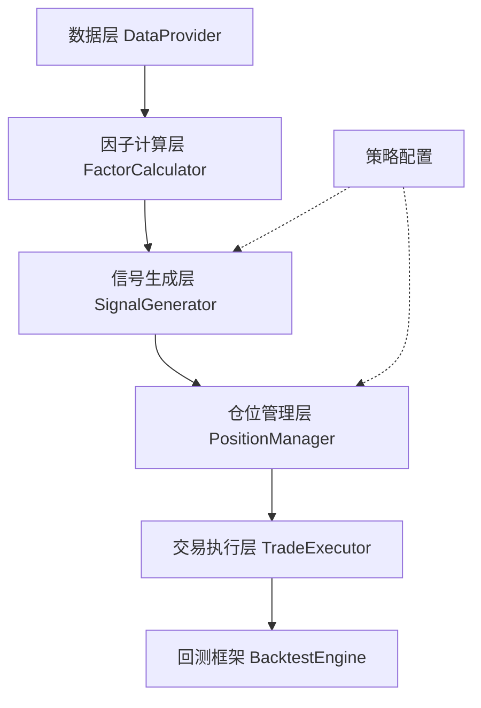

# 基于xtquant的短期强势股量化交易系统实施计划

## 背景

实现一个短期强势股捕获策略，目标年化收益60%，最大回撤<2%。策略核心是挖掘短期增量资金进入的强势股，持有短期获利卖出。需要在5000+只股票上批量运行，严格防止前视偏差。

## 系统架构

采用分层架构，将策略逻辑与交易系统解耦：



**核心模块：**
1. 数据层：封装xtdata数据获取逻辑
2. 因子计算层：计算技术指标、量比等因子
3. 信号生成层：实现买入筛选、上涨趋势打分逻辑
4. 仓位管理层：根据得分计算仓位
5. 交易执行层：对接xttrader执行交易
6. 回测框架：基于xtdata回测基础设施

---

## 任务清单

### 1. 数据层 - 批量数据获取

**文件：** `core/data_provider.py`

**功能：**
- 批量获取5000+股票的日线、分钟线、tick数据
- 使用`get_market_data_ex`批量获取，避免循环调用
- 获取合约基础信息（总股本、涨跌停价等）
- 数据缓存机制，减少重复获取

**关键接口：**
```python
class DataProvider:
    def get_daily_data(stock_list, start, end, fields) -> dict
    def get_minute_data(stock_list, date, fields) -> dict
    def get_instrument_info(stock_list) -> dict
```

**防止前视偏差措施：**
- 所有数据获取时间点必须<=当前bar的时间
- 计算因子时使用shift()避免使用当前bar数据

---

### 2. 因子计算层 - 批量因子计算

**文件：** `core/factor_calculator.py`

**功能：**

**2.1 基础技术指标（批量向量化计算）**
- 移动均线（5/10/20/30/60/120日）
- N日最高价（20/40/60/80/100日）
- N日平均成交量（10日）
- 量比计算

**2.2 买入条件因子**
- 近5日连续上涨判断：`(close > close.shift(1)).rolling(5).sum() == 5`
- 近3日涨幅：`(close / close.shift(3) - 1) * 100`
- 量比计算：`(volume / 累计交易分钟数) / 过去5日平均每分钟成交量`
- 成交金额判断

**2.3 上涨趋势得分因子（0-20分）**
- 股价突破均线（5项，每项1分）
- 创N日新高（5项，每项1分）
- 均线排列（5项，每项1分）
- 成交量放大（5项，每项1分）

**关键接口：**
```python
class FactorCalculator:
    def calc_ma(close_df, periods) -> dict
    def calc_volume_ratio(volume_df, amount_df, time) -> pd.Series
    def calc_uptrend_score(price_df, volume_df, ma_dict) -> pd.Series
```

**批量优化：**
- 使用pandas向量化操作，避免循环
- 预先计算全部股票的因子矩阵（DataFrame）
- 使用numpy加速计算

---

### 3. 信号生成层 - 策略逻辑

**文件：** `strategies/momentum_strategy.py`

**功能：**

**3.1 买入信号生成**
- 实现买入条件1+条件2的逻辑判断
- 计算上涨趋势得分（8-20分）
- 过滤：ST股、上市不足120天、停牌股

**3.2 卖出信号生成**
- 目标收益达成：根据得分计算目标涨幅
- 止损：跌破成本价-3%
- 持仓超期：持有>3个交易日

**3.3 实时买入价格判断（回测中简化）**
- 回测：开盘价买入
- 实盘：检查过去1分钟是否创新高，未创新高则+0.1%挂单

**关键接口：**
```python
class MomentumStrategy:
    def generate_buy_signals(date, stock_pool) -> pd.Series
    def calculate_position_size(scores) -> pd.Series
    def generate_sell_signals(date, holdings) -> list
```

---

### 4. 仓位管理层

**文件：** `core/position_manager.py`

**功能：**
- 根据上涨趋势得分计算仓位（2%-5%）
- 仓位映射表：`{8:2%, 10:2.5%, 12:3%, 14:3.5%, 16:4%, 18:4.5%, 20:5%}`
- 目标收益映射：`{8:2%, 10:2.5%, ..., 20:5%}`
- 持仓跟踪：记录买入成本、买入日期、得分

**关键接口：**
```python
class PositionManager:
    def calc_position_size(score, total_capital) -> float
    def calc_target_profit(score) -> float
    def update_holdings(stock, price, volume, date, score)
    def check_exit_conditions(holdings, current_prices, current_date) -> list
```

---

### 5. 交易执行层

**文件：** `core/trade_executor.py`

**功能：**
- 封装xttrader下单、撤单接口
- 回测模式：使用passorder模拟下单
- 实盘模式：调用xt_trader.order_stock下单
- 订单管理：记录订单状态、成交情况

**关键接口：**
```python
class TradeExecutor:
    def buy(account, stock, price, amount, C=None)
    def sell(account, stock, price, amount, C=None)
    def get_holdings(account) -> dict
    def get_cash(account) -> float
```

---

### 6. 回测引擎

**文件：** `backtest/backtest_engine.py`

**功能：**
- 基于xtdata的`run_strategy_file`框架
- 实现`init()`, `after_init()`, `handlebar()`三个回调
- 性能统计：年化收益、最大回撤、夏普比率、胜率

**关键函数：**
```python
def init(C):
    # 初始化参数、股票池、资金账户

def after_init(C):
    # 批量获取全部历史数据
    # 预先计算全部因子矩阵（防止前视偏差，需shift）

def handlebar(C):
    # 每日交易逻辑
    # 1. 获取当日信号
    # 2. 卖出不满足条件的持仓
    # 3. 买入新信号股票
```

---

### 7. 配置文件

**文件：** `config/strategy_config.py`

**内容：**
```python
# 策略参数
BUY_CONDITION_1 = {
    'consecutive_up_days': 5,
    'or_days': 3,
    'or_pct_change': 6.0
}

BUY_CONDITION_2 = {
    'early_volume_ratio': 8,
    'early_amount': 30000000,
    'late_volume_ratio': 3,
    'late_amount': 50000000,
    'early_minutes': 30
}

POSITION_SIZE_MAP = {8: 0.02, 10: 0.025, 12: 0.03, 14: 0.035, 16: 0.04, 18: 0.045, 20: 0.05}
TARGET_PROFIT_MAP = {8: 0.02, 10: 0.025, 12: 0.03, 14: 0.035, 16: 0.04, 18: 0.045, 20: 0.05}
STOP_LOSS = -0.03
MAX_HOLD_DAYS = 3
MIN_LISTING_DAYS = 120
MAX_POSITIONS = 20  # 最大持仓数（5%*20=100%）
```

---

### 8. 工具函数

**文件：** `utils/helpers.py`

**功能：**
- 时间格式转换
- DataFrame辅助函数（如get_df_ex）
- ST股判断
- 日志记录

---

### 9. 主回测脚本

**文件：** `main_backtest.py`

**功能：**
- 组装各模块
- 设置回测参数（时间范围、初始资金、股票池）
- 运行回测
- 输出结果

**流程：**
```python
if __name__ == '__main__':
    param = {
        'stock_code': '000001.SZ',  # 驱动代码
        'period': '1d',
        'start_time': '2023-01-01',
        'end_time': '2024-12-31',
        'trade_mode': 'backtest',
        'quote_mode': 'history'
    }
    result = run_strategy_file('main_backtest.py', param=param)
    print(result.get_backtest_index())
```

---

### 10. 实盘交易脚本

**文件：** `main_realtime.py`

**功能：**
- 连接xttrader
- 实时获取行情
- 实时计算信号
- 自动下单

---

## 目录结构

```
myquant/
├── config/
│   └── strategy_config.py       # 策略参数配置
├── core/
│   ├── __init__.py
│   ├── data_provider.py         # 数据层
│   ├── factor_calculator.py     # 因子计算层
│   ├── position_manager.py      # 仓位管理层
│   └── trade_executor.py        # 交易执行层
├── strategies/
│   ├── __init__.py
│   └── momentum_strategy.py     # 短期强势股策略
├── backtest/
│   ├── __init__.py
│   └── backtest_engine.py       # 回测引擎
├── utils/
│   ├── __init__.py
│   └── helpers.py               # 工具函数
├── main_backtest.py             # 回测主脚本
└── main_realtime.py             # 实盘主脚本
```

---

## 关键技术点

### 1. 批量数据获取（5000+股票）

**方案：**
```python
# 一次性获取全部股票数据
stock_list = xtdata.get_stock_list_in_sector("沪深A股")
data = xtdata.get_market_data_ex(
    [], stock_list, 
    period='1d', 
    start_time='20230101', 
    end_time='20241231',
    dividend_type='front',
    fill_data=True
)
# 转换为DataFrame矩阵
close_df = pd.DataFrame({s: data[s]['close'] for s in stock_list})
```

**优化：**
- 分批获取（每批500只股票）避免单次请求过大
- 使用多进程并行获取
- 数据缓存到本地pickle文件

### 2. 防止前视偏差

**措施：**
- 在`after_init()`中预先计算全部因子矩阵
- 因子矩阵使用`.shift(1)`向后移动一天
- `handlebar(C)`中只获取当前bar之前的数据
- 买入使用次日开盘价，卖出使用当日开盘价

**示例：**
```python
def after_init(C):
    # 获取数据
    close_df = get_df_ex(data, "close")
    
    # 计算因子
    ma5 = close_df.rolling(5).mean()
    
    # 防止前视偏差：shift(1)
    g.ma5_df = ma5.shift(1)
    g.close_df = close_df.shift(1)

def handlebar(C):
    date = C.current_date
    # 使用昨日收盘价和均线判断
    signal = g.close_df.loc[date] > g.ma5_df.loc[date]
    # 今日开盘价买入
    buy_price = g.open_df.loc[date]
```

### 3. 量比实时计算

**日线回测简化方案：**
- 使用昨日量比代替实时量比
- 计算公式：`volume / 过去5日平均成交量`

**实盘方案：**
- 订阅分钟线或tick数据
- 实时计算累计成交量和时间
- 计算量比：`(今日累计成交量 / 今日已交易分钟数) / 过去5日平均每分钟成交量`

### 4. 成交金额判断

**日线回测简化方案：**
- 使用全天成交金额代替半小时成交金额

**实盘方案：**
- 订阅分钟线数据
- 判断开盘半小时（9:30-10:00）的累计成交金额
- 判断开盘半小时后的累计成交金额

---

## 约束与依赖

1. **数据依赖：** 需要在QMT系统中预先下载历史行情数据
2. **回测框架：** 必须使用xtdata的`run_strategy_file`框架
3. **Python版本：** Python 3.6-3.12
4. **必需库：** xtquant, pandas, numpy

---

## 测试与验证

### 单元测试
- 测试因子计算正确性
- 测试信号生成逻辑
- 测试仓位计算

### 回测验证
- 在沪深300上回测（2023-2024）
- 验证年化收益、最大回撤指标
- 验证无前视偏差（随机抽查买入日期，检查因子计算是否用到未来数据）

### 实盘验证
- 小资金实盘测试
- 监控交易执行情况
- 对比回测与实盘差异

---

## 潜在风险与应对

| 风险 | 应对措施 |
|------|---------|
| 前视偏差 | 严格使用shift()，代码审查 |
| 数据缺失 | 使用fill_data=True填充停牌数据 |
| 涨跌停无法成交 | 回测中检查涨跌停价，实盘挂单策略调整 |
| 5000股票性能问题 | 批量向量化计算，多进程并行 |
| 实盘与回测差异 | 滑点模型、手续费模型、冲击成本模型 |

---

## 后续优化方向

1. **因子优化：** 增加更多技术指标、基本面因子
2. **机器学习：** 使用ML模型预测上涨概率
3. **风控优化：** 动态止损、分批建仓
4. **执行优化：** 算法交易、智能下单
5. **多策略组合：** 开发不同风格策略，组合降低回撤
